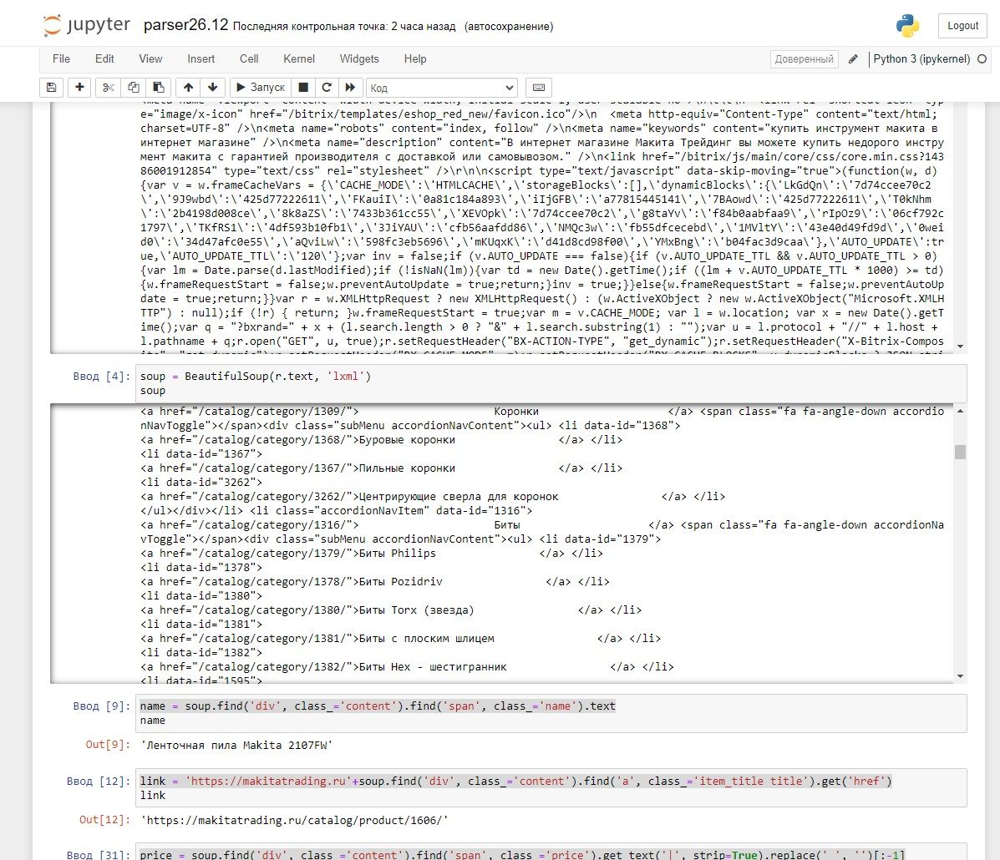

# Parsers
- Для создания и проверки использовал Jupyter Notebook
- Бибилиотеки: requests, BeautifulSoup, pandas

 
  &nbsp;

  

## Файл [parser001.py](https://github.com/mikhailpodolskiy/Parsers/blob/main/parser001.py)
- Простой код, вручную забивал пагинацию для цикла, сбор минимум информации например для проверки РРЦ, или сравнения цен.
- Бибилиотеки для получения информации и обработки информации - requests, bs4
- Библотека для экспорта и сохранения в файл CSV - pandas

## Файл [parser002.py](https://github.com/mikhailpodolskiy/Parsers/blob/main/parser002.py)
- Сбор ссылок для всех товаров с сайта
